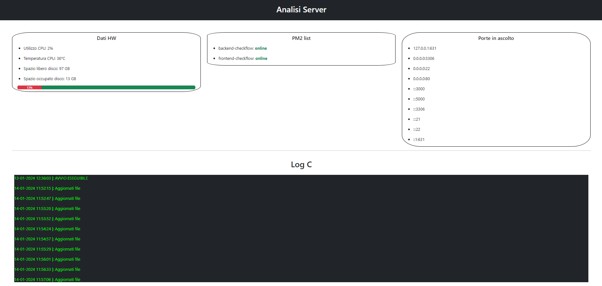

# Analisi_Server

Analisi_Server è un progetto web dinamico che consente di monitorare lo stato del nostro server.

Momentaneamente il mio server gira su rete locale di conseguenza la pagina web che mostra i dati non necessita di un login; resta però da implementare nel caso futuro di installazione su macchine virtuali esposte in internet.
Il sito funzionerà solo su macchine linux da momento che lo script di C lavora su directory delle distribuzioni linux e non windows.

# Interfaccia grafica



# Come avviare il progetto

La prima necessità è quella di far partire il file eseguibile nella cartella _/process/hardware_ attraverso il seguente comando:

```cmd
cd www/process/script
sudo make
sudo ../hardware & > numero_processo.txt
```

Seguentemente aprendo il file nella cartella _www/index.html_ sarà possibile visualizzare la pagina che mostra i dati.

# Script di C

Lo script di C estrapola i seguenti dati:

- percentuale utilizzo CPU;
- temperatura CPU;
- GB del disco usati;
- GB del disco liberi;
- Porte attive in ascolto del server con indirizzi ip;
- Processi pm2 con il loro status.

Nel file stat.json saranno presenti le seguenti informazioni:

- percentuale utilizzo CPU;
- temperatura CPU;
- GB del disco usati;
- GB del disco liberi;

Nel file porte_attive.txt saranno presenti le seguenti informazioni:

- Porte attive in ascolto del server con indirizzi ip;

Nel file processi_pm2.json saranno presenti le seguenti informazioni:

- Processi pm2 con il loro status.

# Script javascript

La pagina index.html richiamerà ogni 30 secondi una chiamata API al file _/php/aggiornamento.php_

# Script PHP

Lo script _aggiornamento.php_ restituirà un body della pagina html e richiamerà le funzioni nello script _function.php_ che permettono di estrapolare i dati dai file costruiti dallo script di C.

# Nginx

Il sito sarà esposto attraverso nginx, per le sue egregie prestazioni in termini di esposizione di sevizi web.

Installare nginx:

```cmd
sudo apt-get install php-fpm
sudo apt-get install nginx
systemctl status nginx
systemctl enable nginx
```

Generazione dei certificati ssl, ecco i comandi da eseguire:

```cmd
cd /etc/nginx/
sudo mkdir ssl
cd ssl
sudo chmod 700 /etc/nginx/ssl
sudo openssl req -x509 -nodes -days 365 -newkey rsa:2048 -keyout /etc/nginx/ssl/[nome_chiave].key -out /etc/nginx/ssl/[nome-certificato].crt
```

Il certificato sarà valido per un anno.

La configurazione è la seguente, questo file andrà inserito in _/etc/nginx/sites-available/analisi_server_:

```nginx
server{
    listen 443 ssl;

    ssl_certificate /etc/nginx/ssl/analisi_server.crt;
    ssl_certificate_key /etc/nginx/ssl/analisi_server.key;

    root /home/sito/www;
    index index.php;

    location / {
        root /home/sito/www;
        index index.php;
    }

    location ~ \.php$ {
        include fastcgi_params;
        fastcgi_pass unix:/run/php/php8.2-fpm.sock;
        fastcgi_index index.php;
        fastcgi_param SCRIPT_FILENAME $document_root$fastcgi_script_name;
    }
}


```

Ricordati di modificare i permessi della directory indicata nella root attraverso i seguenti comandi:

```cmd
chmod -R o+rx /home/sito/
sudo chmod -R o+rx /run/php

```

Il seguente file dopo essere stato creato andrà effettuato un link del file _/etc/nginx/sites-available/analisi_server_ in _/etc/nginx/sites-enable/analisi_server_

```cmd
ln -s /etc/nginx/sites-available/analisi_server /etc/nginx/sites-enabled
```

Elimina in enable il link default per non creare conflitti durante l'esposizione.

Infine rilancia il servizio per visualizzare le modifiche online:

```cmd
sudo nginx -t
sudo nginx -s reload
```

# Script per lanciare il servizio

Crea un file contente questo pezzo di codice ovviamente modifica il percorso della directory con il percorso adeguato al tuo ambiente.

Il file dovra essere di estensione ".sh", dopo aver salvato il file esegui il seguente comando per dare i permessi di esecuzione:

```cmd
sudo chmod +x nome_file.sh
sudo ./nome_file.sh
```

```sh
#!/bin/bash
echo "script iniziato"

#Percorso della directory contente il processo
percorso="/home/sito/www/process/"

cd "$percorso" || { echo "Errore nel cambio directory."; exit 1; }

rm log.txt

#Eseguo il processo in background
./hardware &

#riavvio nginx
systemctl reload nginx

echo "script terminato"
```
